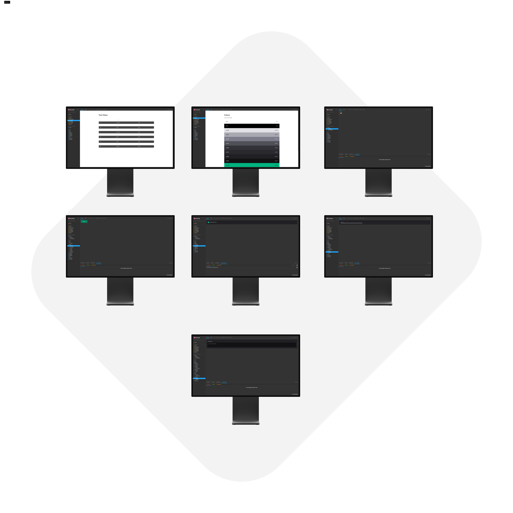
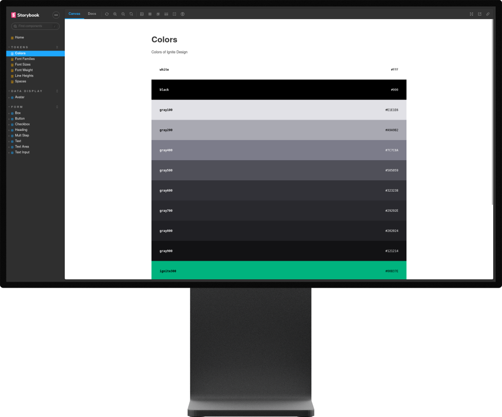
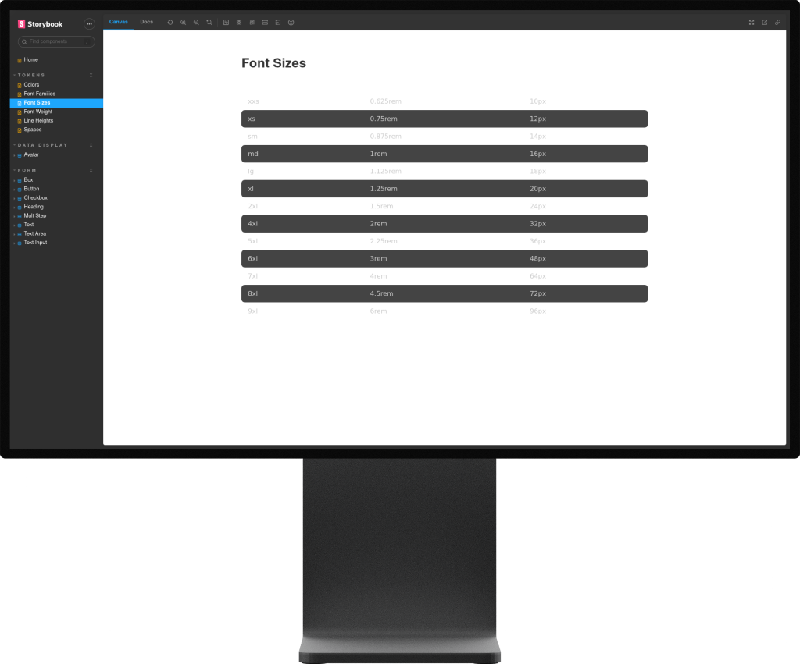

<p align="center">
  <a href="https://raferdev.github.io/storybook_ignite/?path=/story/home--page">
 </a>
</p>

<h3 align="center">Storybook - Design System</h3>

<p align="center">


</p>

---



---

<p align="center"> This Design System was created on Rocketseat course and was builded using the Storybook powerfull tool to describe and support us with create, document, manutenance and visualize the patterns of our projects. It's components and tokens that are reusable and saved on npm like packages for our future displays.
</p>

## 📝 Table of Contents

- [About](#about)
- [Getting Started](#getting_started)
- [Usage](#usage)
- [Built Using](#built_using)
- [Authors](#authors)

## 🧐 About <a name = "about"></a>

This project is the fifth part of Rocketseat ReactJs course with i am using to stay solid with the most actual and best practices on frontend projects. This is how to stay more formal with frontend documentation and professional usage, the Storybook is a NodeJS lib with help us to manutenance and reusability design pattens.

More than that the _monorepo_ is used here and help us to administrate all packages using one repository. It's used _turborepo_ lib, and _changeset_ lib, to automatize the changes and commit's, and github actions to do the CI/CD work.

## 🏁 Getting Started <a name = "getting_started"></a>

You can clone the project and start on your local host or open the site hospeded <a href="https://raferdev.github.io/storybook_ignite/?path=/story/home--page">here</a>

Clone

```
git clone https://github.com/raferdev/storybook_ignite
```

Install Dependencies

```
npm i
```

Start Server

```
npm run dev
```

The browser will remote open on the local link on port 6006. Exemple .:

```
http://localhost:6006
```

## 🎈 Usage <a name="usage"></a>

- You can see all the documentation of the components and tokens.
- If the component have proprieties you can change them on options, see the acessibility, and more details.
- Exemple using some token pages:

### Colors



### Font Sizes



## ⛏️ Built Using <a name = "built_using"></a>

- [HTML](https://developer.mozilla.org/pt-BR/docs/Web/HTML) - Markup Language
- [Stitches](https://stitches.dev/) - CSS-in-JS lib

- [Typescript](https://developer.mozilla.org/pt-BR/docs/Web/typescript) - Javascript with super powers language
- [ReactJS](https://pt-br.reactjs.org/) - Javascript Superset Library
- [TurboRepo](https://turbo.build/) - Incremental bundler and build system.
- [NodeJS](https://nodejs.org/en) - Javascript runtime environment.

## ✍️ Authors <a name = "authors"></a>

- [@raferdev](https://github.com/raferdev) - build
- [@rocketseat](https://github.com/rocketseat) - idea
